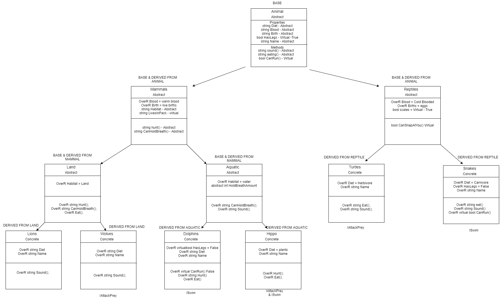
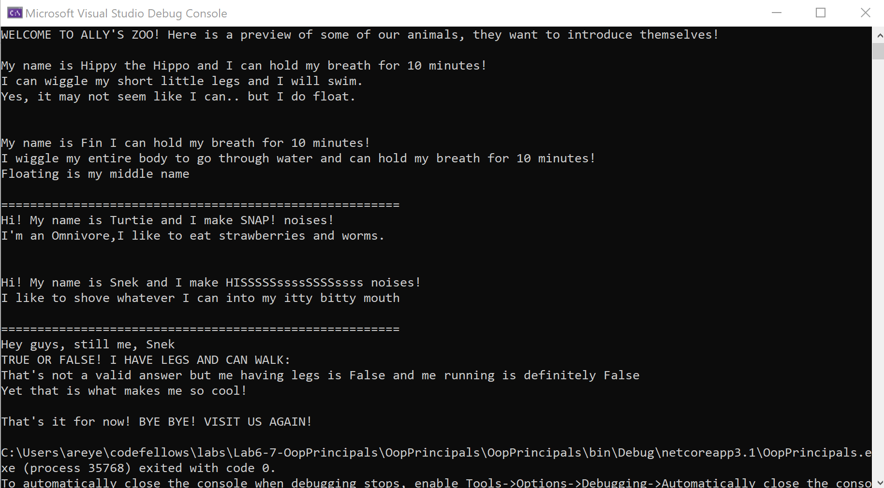

# OOP and Interface

Lab01&07-OOP Principals and Interface

*Author: Allyson Reyes*

----

## Description
This is a C# application that previews some animals inside of a virtual zoo. You can see that they have their own traits and behaviors.

---

### Getting Started
Clone this repository to your local machine.

```
$ git clone [https://github.com/areyes986/Lab6-7-OopPrincipals.git]
```

Then inside your terminal, make sure you are inside the folder of the cloned repo and find program.cs.

Still inside your terminal, run dotnet run.

---

### Visuals

#### UML Diagram

#### Result


---
### OOP Principals
Object Oriented Programming (OOP), have four components to it:
**Inheritance**  
This allows you to create new classes that reuse,extend, and modify behaviors defined in other classes.  

**Abstract**  
Is a class template to define basic information. It is not allowed to be instantiated.  

**Polymorphism**  
This lets you change behaviors and values of selected methods or properties. Abstract methods/properties must be overridden and virtual is optional.  

**Encapsulation**  
This lets you group specific information together for reuseability.

---
### Interface
Interfaces tell us what a class can do and classes that implement these interfaces "inherit" the methods and properties in them. If a class implements the interface, the class needs to implement all properties and methods within the interface or you will get an error.  

### Change Log
1.4: *Readme* - 3/25/2020
1.3: *Coded out in program.cs for console* - 3/25/2020 
1.2: *Unit testing passes* - 3/25/2020
1.1: *Created structure of the different classes, implemented properties and methods* - 3/24/2020


------------------------------
